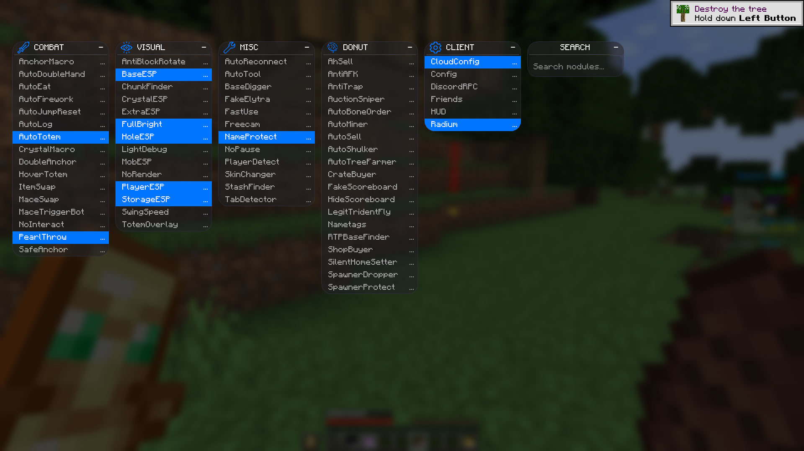

  

# Radium Client

⚡ **Radium Client** is a powerful Minecraft utility client focused on PvP, automation, visuals, and Donut SMP–specific features.  
Designed for performance, configurability, and competitive gameplay.

> ⚠️ **Disclaimer**  
> This client is intended for educational purposes only.  
> Using utility clients on servers may violate their rules and can result in bans.

---

# DOWNLOAD: **[OFFICIAL RADIUM WEBSITE](https://radiumclient.net/)**

### Supported Versions
✔ Fabric 
✔ 1.21.1 - 1.21.11  

---

## ✨ Features

### ⚔️ Combat
- Aim Assist  
- AnchorMacro  
- AnchorMacro v2  
- AutoCrystal  
- AutoDoubleHand  
- AutoEat  
- AutoFirework  
- AutoJumpReset  
- AutoLog  
- AutoTotem  
- Crystal Macro  
- Crystal Optimizer  
- DoubleAnchor  
- HoverTotem  
- InvTotem  
- ItemSwap  
- MaceSwap  
- NoInteract  
- PearlThrow  
- SafeAnchor  
- TriggerBot  

---

### 👁️ Visual
- AntiBlockRotate  
- BaseESP  
- BlockESP  
- ChunkFinder  
- CrystalESP  
- ExtraESP  
- FullBright  
- HoleESP  
- ItemESP  
- LightDebug  
- MobESP  
- NoRender  
- PlayerESP  
- SeeThroughWalls  
- StorageESP  
- SwingSpeed  
- TotemOverlay  

---

### 🍩 Donut SMP
- AhSell  
- AntiAFK  
- AntiTrap  
- AuctionSniper  
- AutoBoneOrder  
- AutoSell  
- AutoShulker  
- AutoTreeFarmer  
- CrateBuyer  
- FakeScoreboard  
- HideScore  
- LegitTridentFly  
- Nametags  
- RTPBaseFinder  
- ShopBuyer  
- SilentHomeSetter  
- SpawnerDropper  
- SpawnerProtect  
- TunnelBaseFinder  

---

### 🧩 Misc
- AutoReconnect  
- AutoReplenish  
- AutoTool  
- AutoTPA  
- BaseDigger  
- Compass  
- FakeElytra  
- FakePlayer  
- FastUse  
- Freecam  
- Freelook  
- NameProtect  
- NoPause  
- PlayerDetect  
- SkinChanger  
- StashFinder  
- TabDetector  

---

### 🖥️ Client
- CloudConfig  
- Config  
- DiscordRPC  
- Friends  
- HUD  
- Radium  
- Account Manager  

---

## 📦 Installation
1. Download Radium Client from the link above.
2. Place the `.jar` file into your Minecraft `mods` folder.
3. Launch Minecraft using the supported loader.
4. Open the GUI in-game and configure modules.

**You will need a fabric api & fabric loader, best choice would just be use a feather client**

---

## ⭐ Credits
Developed by **Radium Client Team**
